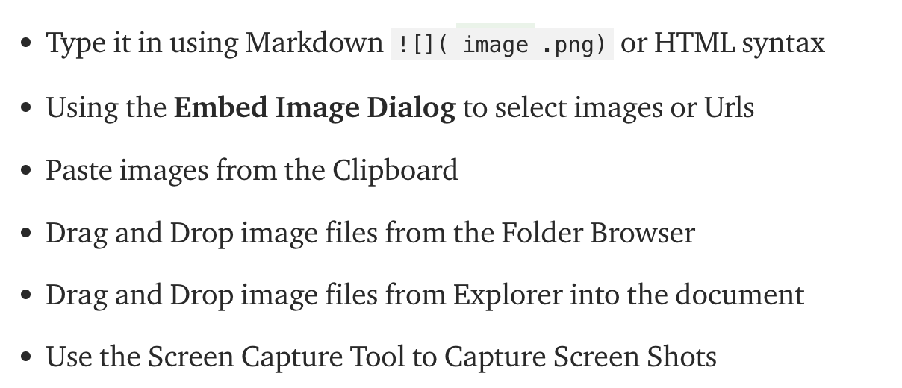

# THis is a markdown document.
Open it with any text editor, and its fairly readeble. 
This is its main strength, over other markup languages, like latex. 


## extention for preview
Open it in visual studio code and finde the extention: markdown all in one. 
This allows you to preview your document among others things. 


headings are made with # 
# h1 
## h2
### h3
and so forth. 

# Code snippet 
Code snippets are made with "```"

Like This

```
 <some code snippet>
```
Want syntax? write the desired code languages to syntax highlight right after the first "```"
Like so:

```cpp 
int main () {
    int age; 

}
```

# Screen shots 

```

```

Or alternatively from an other folders 


## 
