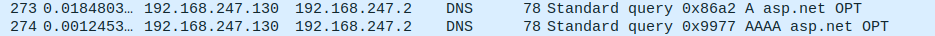
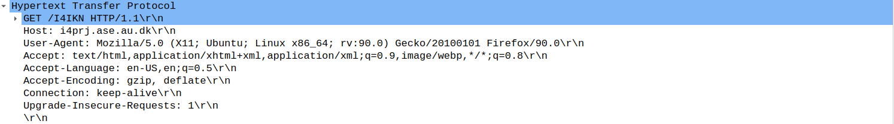
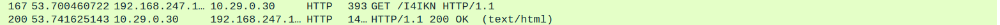
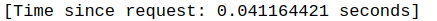
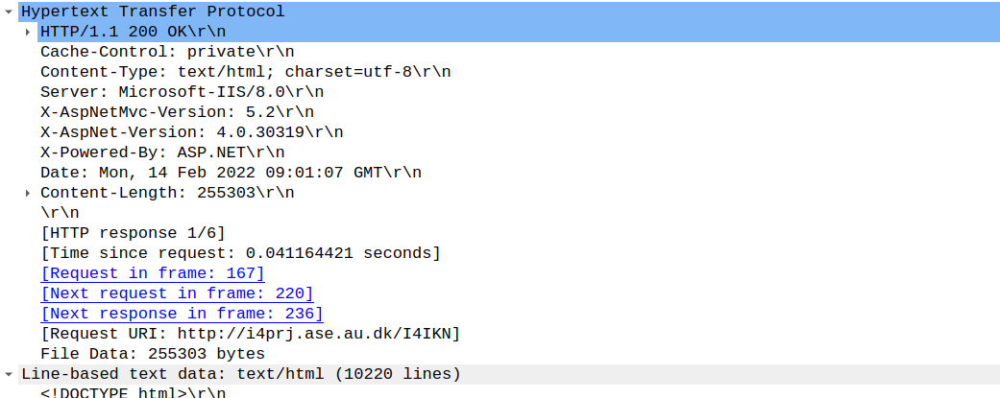

# Hello world

* We connect to http://i4prj.ase.au.dk/I4IKN using Mozilla Firefox
* To check which IP address we communicate with we can
    * compare text from http packets to the website text
    * check the first HTTP request after TCP handshakes
    * filter http.host in Wireshark and check the packets 

[comment]: <Unused (Screendumps/sample_http_content.png)> 

To check http header request, we check the http GET/ packet

The time difference between GET request and OK response can be found by examining the relevant response packet in Wireshark:

The response packet provides infromation about the server, date, the type of content provided as well as the content itself.

In this case the type of content is html text and the server is Microsft-IIS. Under the header the HTML-encoded content is provided.