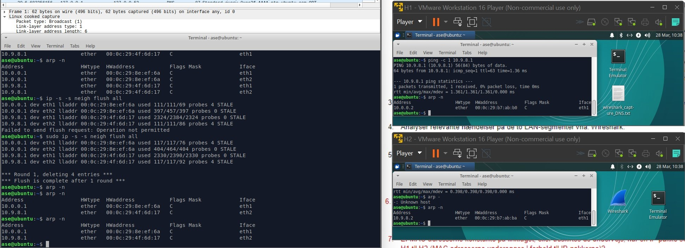
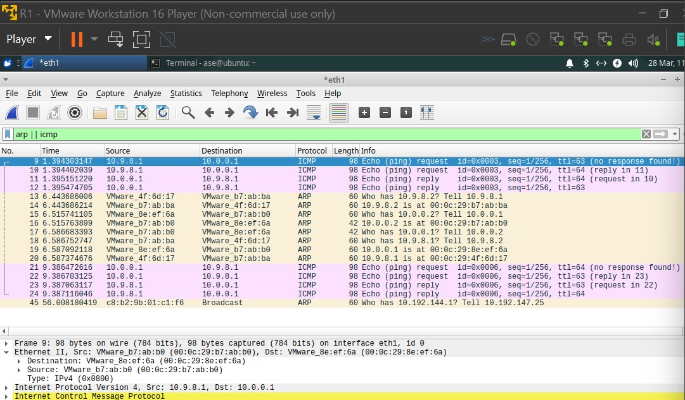
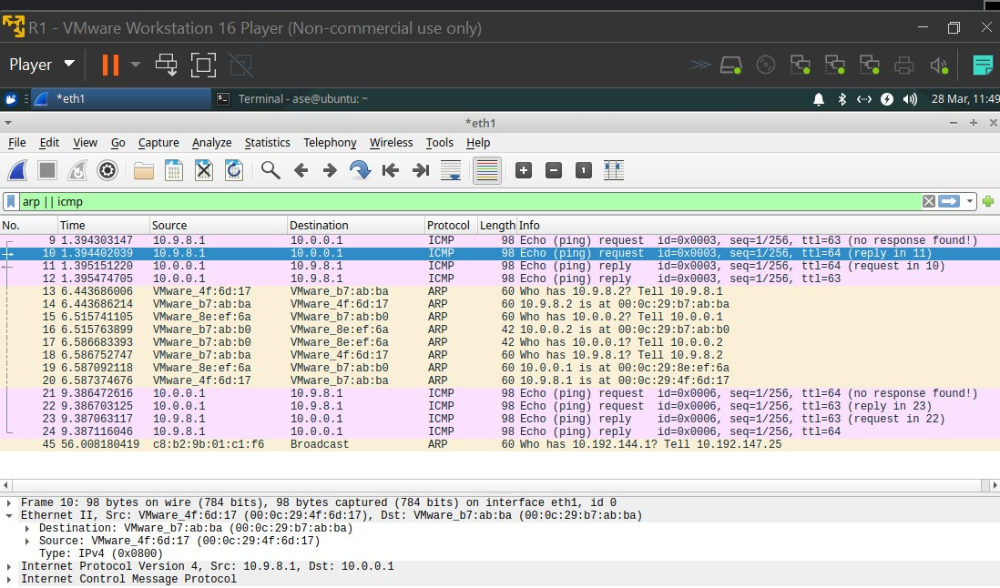
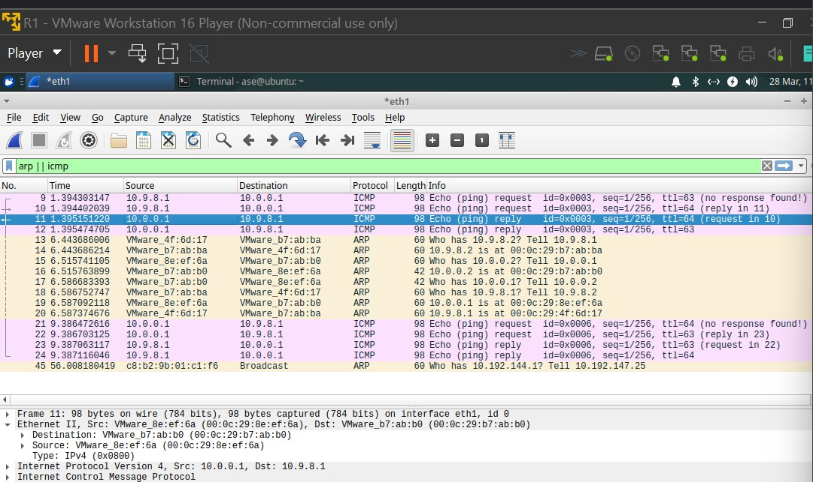
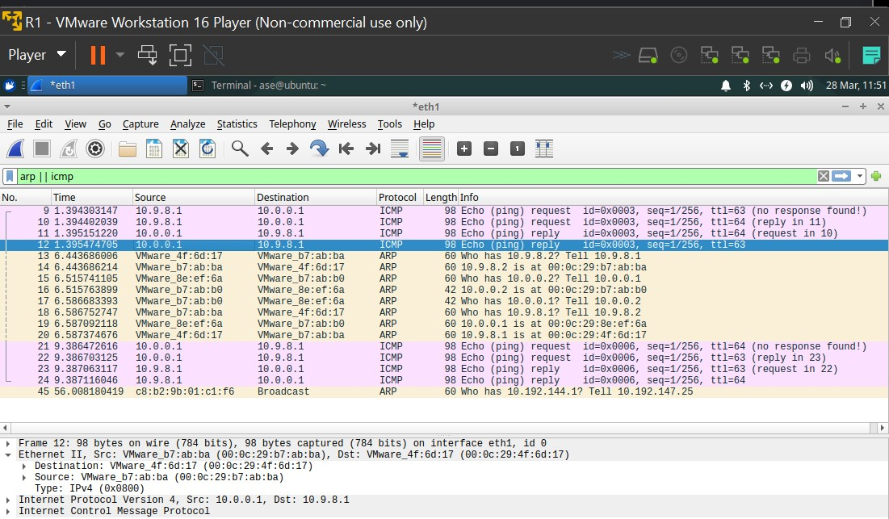

# Question 6
## Analyse on link layer with WireShark. Focus on MAC adresses. 
Before trying to figure anything out we first identify the specific MAC adresses across the three VMs.



Read from arp -n on R1
MAC-a: 
00:0c:29:8e:ef:6a

Read from arp -n on H1
MAC-b: 
00:0c:29:b7:ab:b0

Read from arp -n on H2
MAC-c:
00:0c:29:b7:ab:ba

Read from arp -n on R1
MAC-d:
00:0c:29:4f:6d:17

Afterwards we sent out a single ping from H2 to H1 and a single ping from H1 to H2. This capture is shown below: 

```
No.	Time	    Source	        Destination	    Protocol	Length	Info
9	1.394303147	10.9.8.1	    10.0.0.1	    ICMP	    98	    Echo (ping) request  id=0x0003, seq=1/256, ttl=63 (no response found!)
10	1.394402039	10.9.8.1    	10.0.0.1    	ICMP    	98  	Echo (ping) request  id=0x0003, seq=1/256, ttl=64 (reply in 11)
11	1.395151220	10.0.0.1    	10.9.8.1    	ICMP    	98  	Echo (ping) reply    id=0x0003, seq=1/256, ttl=64 (request in 10)
12	1.395474705	10.0.0.1    	10.9.8.1    	ICMP    	98  	Echo (ping) reply    id=0x0003, seq=1/256, ttl=63
13	6.443686006	VMware_4f:6d:17	VMware_b7:ab:ba	ARP	        60  	Who has 10.9.8.2? Tell 10.9.8.1
14	6.443686214	VMware_b7:ab:ba	VMware_4f:6d:17	ARP     	60	    10.9.8.2 is at 00:0c:29:b7:ab:ba
15	6.515741105	VMware_8e:ef:6a	VMware_b7:ab:b0	ARP     	60  	Who has 10.0.0.2? Tell 10.0.0.1
16	6.515763899	VMware_b7:ab:b0	VMware_8e:ef:6a	ARP     	42  	10.0.0.2 is at 00:0c:29:b7:ab:b0
17	6.586683393	VMware_b7:ab:b0	VMware_8e:ef:6a	ARP     	42  	Who has 10.0.0.1? Tell 10.0.0.2
18	6.586752747	VMware_b7:ab:ba	VMware_4f:6d:17	ARP     	60  	Who has 10.9.8.1? Tell 10.9.8.2
19	6.587092118	VMware_8e:ef:6a	VMware_b7:ab:b0	ARP     	60  	10.0.0.1 is at 00:0c:29:8e:ef:6a
20	6.587374676	VMware_4f:6d:17	VMware_b7:ab:ba	ARP     	60  	10.9.8.1 is at 00:0c:29:4f:6d:17
21	9.386472616	10.0.0.1    	10.9.8.1    	ICMP    	98  	Echo (ping) request  id=0x0006, seq=1/256, ttl=64 (no response found!)
22	9.386703125	10.0.0.1    	10.9.8.1    	ICMP    	98  	Echo (ping) request  id=0x0006, seq=1/256, ttl=63 (reply in 23)
23	9.387063117	10.9.8.1    	10.0.0.1    	ICMP    	98  	Echo (ping) reply    id=0x0006, seq=1/256, ttl=63 (request in 22)
24	9.387116046	10.9.8.1    	10.0.0.1    	ICMP    	98  	Echo (ping) reply    id=0x0006, seq=1/256, ttl=64
```
We notice that VMWare has this unique first part of the MAC adresses called VMWare_ which in hex is just 00:0c:29.

In the above capture from wireShark we are first sending one ping from H2 to H1, followed by one ping from H1 to H2.
As in the former exercise we see that on the transport layer the source and destination are the same through out the ping but now when we look at the link layer we can see that the source and destination is changing throughout the ping. 

In terms of the ARP we see that with a clear ARP table on the router the ping is triggering a type of message with the info "Who has x tell x" This is in order to populate the ARP table on the router. It is wierd that thesse packages are shown as being sent after the ICMP packages, when the MAC adresses are needed in order to actually send the package from H2 to H1.

In the below screenshots we highlighted the four packages that is being sent when we ping from H2 to H1. Thesse packages will be examined further in Question 7.






# Question 7
## Are the MAC adresses constant on the link layer, or are they changed during transfer of IP packages.

Below is a snippet of relevant data from the aforementioned packages in Question 6.

    Proto = ICMP (ping) request
    No. 10: Src = 00:0c:29:4f:6d:17 Dst = 00:0c:29:b7:ab:ba
    Source = MAC-d (H2) Destination = MAC-c (R1)

    Proto = ICMP (ping) request
    No. 09: Src = 00:0c:29:b7:ab:b0 Dst = 00:0c:29:8e:ef:6a
    Source = MAC-b (R1) Destination = MAC-a (H1)

    Proto = ICMP (ping) reply 
    No. 12: Src = 00:0c:29:b7:ab:ba Dst = 00:0c:29:4f:6d:17
    Source = MAC-c (R1) Destination = MAC-d (H2)

    Proto = ICMP (ping) reply
    No. 11: Src = 00:0c:29:8e:ef:6a Dst = 00:0c:29:b7:ab:b0  
    Source = MAC-a (H1) Destination = MAC-b (R1)

We notice that the MAC addreses in the source and destination fields are changing on the journey from one VM through the router VM to the last VM. This is because on the link layer we are only moving packages to the neighbour, and then the neighbour moves it onto his neighbour. 

In the snippet above, the first two packages are the ping request. Notice that in wireshark they are displayed in reverse order in terms of arrival, ping request was started on H2 towards H1, and this is seen on the link layer as MAC-d -> MAC-c followed by MAC-b -> MAC-a

This request is then followed up by the reply which is once again in the reverse order. The pathway of the reply when looking at the link layer is MAC-a -> MAC-b followed by MAC-c -> MAC-d

In conclussion the MAC adress are not constant on the link layer.