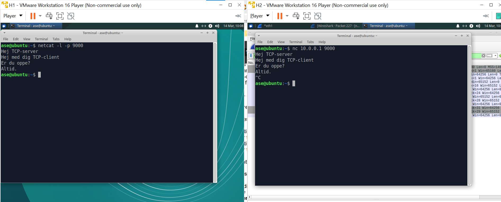

## TCP client-server analyse med Wireshark

To make a TCP communication analysis we establish a TCP server and a TCP client with netcat, send 4 different strings between the client and the server, and finally close the connection by closing the client. 

This conversation has been recorded via Wireshark and all the different TCP segments are seen below.

The three way handshake can be seen in segments 147-149. We take a closer look at each of these segments. Flag is a single byte, Seq and Ack numbers are 4 bytes each and window size is 2 bytes.

Segment 147:
* Client --> Server (client initiates the connection)
* Only SYN flag is set
* Seq counter is 0 (seq number is chosen randomly)
* Ack counter AND number is 0
* Window size is 64240

Segment 148:
* Server --> Client 
* Flags set are SYN, ACK
* Seq counter is 0 (different seq number is chosen randomly)
* Ack counter is 0 (new number is chosen randomly)
* Window size is slightly higher than previous segment

Segment 149:
* Client --> Server
* Only ACK flag is set
* Seq counter is 1 (1 higher than seg 237)
* Ack counter is 1 (1 higher than previous seg)

Segments 218 - 231 constitute an exchange of strings between the client and the server. The important points about them are:
* Every time a host sends x amount of data, it gets an ACK flagged response, with ACK counter set to prev ACK + x. Fx. when client sends 15 bytes of data server responds with ACK flag set and ACK counter set to prevACK + 15.
* After a host receives an ACK it's SEQ counter is set to ACK.