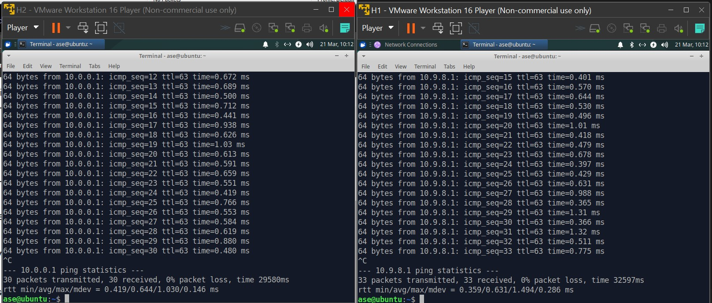
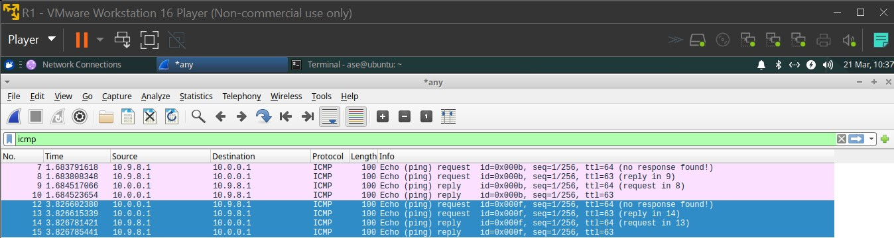

# Task 1 
After adding an extra network adabter to R1, and configureing the network settings on alle the machines, H1 and H2 is ping from R1 

## ping from R1 to H1
```shell
ase@ubuntu:~$ ping -c 1 10.0.0.1
PING 10.0.0.1 (10.0.0.1) 56(84) bytes of data.
64 bytes from 10.0.0.1: icmp_seq=1 ttl=64 time=0.350 ms

--- 10.0.0.1 ping statistics ---
1 packets transmitted, 1 received, 0% packet loss, time 0ms
rtt min/avg/max/mdev = 0.350/0.350/0.350/0.000 ms
```
## ping from R1 to H2
```
ase@ubuntu:~$ ping -c 1 10.9.8.1
PING 10.9.8.1 (10.9.8.1) 56(84) bytes of data.
64 bytes from 10.9.8.1: icmp_seq=1 ttl=64 time=0.957 ms

--- 10.9.8.1 ping statistics ---
1 packets transmitted, 1 received, 0% packet loss, time 0ms
rtt min/avg/max/mdev = 0.957/0.957/0.957/0.000 ms
```

# task 2. 

In this exercise we configure router to forward ips
```shell
ase@ubuntu:~$ cat /proc/sys/net/ipv4/ip_forward
0
ase@ubuntu:~$ sudo sysctl -w net.ipv4.ip_forward=1 
[sudo] password for ase: 
net.ipv4.ip_forward = 1
ase@ubuntu:~$ cat /proc/sys/net/ipv4/ip_forward
1
```


# Question 3

After the router was set up, H1 and H2 was tested with the ping command. This can be seen on the screenshot below.



# Question 4

To analyse the communication between H1 and H2 we change so they only ping eachoter once. On the R1 machine we can then open wireshark and see the packages shown below: 



The lines highlighted are ping from H1 to H2. 
The lines not highlited are the ping from H2 to H1.

# Question 5

Looking at the data packet
Ping from H2 to H1 going through R1

```
No.	Time	Source	Destination	Protocol	Length	Info
7	1.683791618	10.9.8.1	10.0.0.1	ICMP	100	Echo (ping) request  id=0x000b, seq=1/256, ttl=64 (no response found!)
8	1.683808348	10.9.8.1	10.0.0.1	ICMP	100	Echo (ping) request  id=0x000b, seq=1/256, ttl=63 (reply in 9)
9	1.684517066	10.0.0.1	10.9.8.1	ICMP	100	Echo (ping) reply    id=0x000b, seq=1/256, ttl=64 (request in 8)
10	1.684523654	10.0.0.1	10.9.8.1	ICMP	100	Echo (ping) reply    id=0x000b, seq=1/256, ttl=63
```


We see in line 7 and 8 two requests looking like its comming straight from H1 to H2 twice.
We see in line 9 and 10 two replyes looking like again its comming straight from H2 back to H1 twice.

However what is actually happening is that the first request is going to R1, and then R1 is forwarding the request to H2. 
Similar is the process for the reply, where the first reply is going from H2 to R1, and then from R1
back to H1. 

Ping fom H1 to H2 going through R1

```
No.	Time	Source	Destination	Protocol	Length	Info
12	3.826602380	10.0.0.1	10.9.8.1	ICMP	100	Echo (ping) request  id=0x000f, seq=1/256, ttl=64 (no response found!)
13	3.826615339	10.0.0.1	10.9.8.1	ICMP	100	Echo (ping) request  id=0x000f, seq=1/256, ttl=63 (reply in 14)
14	3.826781421	10.9.8.1	10.0.0.1	ICMP	100	Echo (ping) reply    id=0x000f, seq=1/256, ttl=64 (request in 13)
15	3.826785441	10.9.8.1	10.0.0.1	ICMP	100	Echo (ping) reply    id=0x000f, seq=1/256, ttl=63

```

the above packages show the exact same thing just from the H1 point of view. 

So in conclusion, we see that the IP stays the same through out the ping transfer and is simple just forwarded through. 