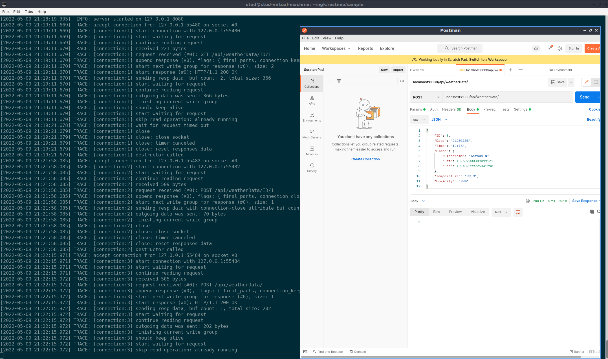

# Part 1 ( Web server )

## Introduction
For this and the following parts we are using a c++ header only library called restinio to implement the web server. The genereal structure of the server program is as follows.

In the main function there is a call to restinio::run(). This is what starts the server. 

```Cpp
restinio::run(
			restinio::on_this_thread< traits_t >()
				.address( "localhost" )
				.request_handler( server_handler(weather_data_collection))
				.read_next_http_message_timelimit(10s)
				.write_http_response_timelimit(1s)
				.handle_request_timeout(1s));
```

Notice that one of the parameters for run(), is a request_handler function. This is the next requirement. Therefore we create such a function, and since we are interrestend in having data, the parameter for the function server_handler takes a struct of type weather_data_collection_t, which is just a vector list of type weather_data_t. Inside the server_handler() there is some boilerplate code at the top but the relevant part is the use of the so called "router". This is how we map specif requests to a functionality, that the server will perform. A code snippet and further explanation will be given later in this journal. 

## What the server must be able to do  

Create a web server, that will act as a weather station which contains information about the weather.
For this first part the server must simple return a static html page with some hardcoded weatherdata.

The hardcoded data found in the first version of the webserver should be like this:


The values above are instansiated in the main function before being passed to the serverhandler in
the call to restinio::run(). This way the server will contain data in its weatherDataCollection struct.
This can be shown in the below code snippet:
```Cpp
int main()
{
	using namespace std::chrono;
	
	try
	{
		using traits_t =
			restinio::traits_t<
				restinio::asio_timer_manager_t,
				restinio::single_threaded_ostream_logger_t,
				router_t >;

		weather_data_collection_t weather_data_collection{
			{ "1", "20211105", "12:15", {"Aarhus N", 13.692, 19.438}, "13.1", "70%" },
		}; 	
    ...
```

## The data structures in the server
In order to both store and be able to parse data to and from json, we have to define some structs inside the server program. The reason for using structs is that thats how the restinino library works in conjunction with the json_dto library. The two structs weather_data_t and place_t are shown below:

```Cpp
struct place_t 
{
	place_t() = default;
	
	place_t(std::string placeName, float lat, float lon) 
			: m_placeName{std::move( placeName ) }
			, m_lat{std::move( lat )}
		    , m_lon{std::move( lon )}
	{}

	template<typename JSON_IO>
	void
	json_io(JSON_IO &io)
	{
		io
			& json_dto::mandatory( "PlaceName", m_placeName )
			& json_dto::mandatory( "Lat"	  , m_lat 		)
			& json_dto::mandatory( "Lon"	  , m_lon 		);
	}	

	std::string m_placeName;
	float m_lat;
	float m_lon;
};

struct weather_data_t 
{
	weather_data_t() = default;
	
	weather_data_t(std::string id, std::string date, std::string timeOfEntry, 
					place_t place, std::string temp, std::string rh)
		:	m_id{std::move( id ) } 	
		,   m_date{std::move( date ) }
		,   m_time{std::move( timeOfEntry ) }
		,	m_place{std::move( place ) }
		, 	m_temp{std::move( temp ) }
		,	m_rh{std::move( rh ) }
	{}

	template<typename JSON_IO>
	void
	json_io(JSON_IO &io)
	{
		io
			& json_dto::mandatory( "ID"   		, m_id   )
			& json_dto::mandatory( "Date" 		, m_date )
			& json_dto::mandatory( "Time" 		, m_time )
			& json_dto::mandatory( "Place"		, m_place)
			& json_dto::mandatory( "Temperature", m_temp )
			& json_dto::mandatory( "Humidity"	, m_rh 	 );
	}

	std::string m_id;
	std::string m_date;
	std::string m_time;
	place_t m_place;
	std::string m_temp;
	std::string m_rh;
};
```
Notice how the structs are encapsulating the template function "json_io" which is where the mapping of key value pairs are done. This will not be needed right now, but in later parts, where we instead of static html responses, are creating responses with dto's (data transfer objects).

## Routing of http method and URL
In the forementioned server_handler function we now add a http_get to the router where we specify the URL and method for handling the request. The code snippet below shows how this is done:
```Cpp
auto server_handler(weather_data_collection_t & weather_data_collection) 
{
	auto router = std::make_unique<router_t>();
	auto handler = std::make_shared<weather_data_handler_t>(std::ref(weather_data_collection));

	auto by = [&](auto method) {
		using namespace std::placeholders;
		return std::bind(method, handler, _1, _2);
	};

	auto method_not_allowed = [](const auto & req, auto) {
			return req->create_response(restinio::status_method_not_allowed())
					.connection_close()
					.done();
		};

 ...
	// Handler for returning the hardcoded weatherdata as html table.
	router->http_get( "/api/weatherDataHtmlTable", by(&weather_data_handler_t::on_weatherData_htmlTable));
...
```

## Implementing the method  


```Cpp
auto on_weatherData_htmlTable(const restinio::request_handle_t& req, rr::route_params_t) const
	{
		auto resp = init_resp(req->create_response());

		resp.append_header("Server", "WeatherStation API Interface");
		resp.append_header_date_field();
		resp.append_header(
					restinio::http_field::content_type,
					"text/html; charset=utf-8");	
		resp.set_body("<!DOCTYPE html><html><style>table, th, td {border:1px solid black;}</style><body>");
		resp.append_body("<h2>WeatherStation</h2>");

		// link for table code check https://www.w3schools.com/html/tryit.asp?filename=tryhtml_table3
		for (auto i = m_weather_data.begin(); i != m_weather_data.end(); i++)
		{
			resp.append_body("<table style='width:100%'>");
			resp.append_body("<tr>");
			resp.append_body("<th>Field</th>");
			resp.append_body("<th>Field value</th>");
			resp.append_body("</tr>");
			resp.append_body("<tr>");
			resp.append_body("<td>ID</td>");
			resp.append_body("<td>" + i->m_id + "</td>");
			resp.append_body("</tr>");
			resp.append_body("<tr>");
			resp.append_body("<td>Date</td>");
			resp.append_body("<td>" + i->m_date + "</td>");
			resp.append_body("</tr>");
			resp.append_body("<tr>");
			resp.append_body("<td>Time</td>");
			resp.append_body("<td>" + i->m_time + "</td>");
			resp.append_body("</tr>");
			resp.append_body("<tr>");
			resp.append_body("<td>PlaceName</td>");
			resp.append_body("<td>" + i->m_place.m_placeName + "</td>");
			resp.append_body("</tr>");
			resp.append_body("<tr>");
			resp.append_body("<td>Lat</td>");
			resp.append_body("<td>" + std::to_string(i->m_place.m_lat) + "</td>");
			resp.append_body("</tr>");
			resp.append_body("<tr>");
			resp.append_body("<td>Lon</td>");
			resp.append_body("<td>" + std::to_string(i->m_place.m_lon) + "</td>");
			resp.append_body("</tr>");
			resp.append_body("<tr>");
			resp.append_body("<td>Temperature</td>");
			resp.append_body("<td> " + i->m_temp + "</td>");
			resp.append_body("</tr>");
			resp.append_body("<tr>");
			resp.append_body("<td>Humidity</td>");
			resp.append_body("<td>" + i->m_rh + "</td>");
			resp.append_body("</tr></table>");
			resp.append_body("<br>");
		}
		resp.append_body("</body></html>");
		return resp.done();
	}
```

## Testing the server

In order to test the webserver we will be using the browser mozilla firefow, since we are only needing to send a GET request to the URL "localhost:8080/api/weatherDataHtmlTable". The result of the test is shown below:


This is all for the first part.

# Part 2 ( Creating a Web API )

## What the API must be able to do

### Create new weatherData
Through the use of the API a user must be able to add new data to the server.

### Fetching weatherData from the server
The user of the API must be able to fetch the three latest weatherData entries from the server.
Furthermore be able to fetch weatherData based on the date. 
Lastly the user should be able to fetch all weatherData entries from the server.

### Updating existing weatherData
The user should be able to update existing weatherData, which will then be stored in the server, so
other clients will be able to see the new data. 

## Adding more routing
In our server_handler function mentioned before, we will be adding a few more routings to handle the expansion and evolution of our server, in order to make a proper API. 
The addditions can be seen below:
```cpp
// get all entries from weater_data_collection_t 
	router->http_get("/api/weatherData", by(&weather_data_handler_t::on_weatherData_all_get));

	// get latest three entries from weather_data_collection_t
	router->http_get("/api/weatherData/threeLatest", by(&weather_data_handler_t::on_weatherData_threeLatest_get));

	// get one entry based on id from weather_data_collection_t
	router->http_get(R"(/api/weatherData/id/:weatherDataID(\d+))", by(&weather_data_handler_t::on_weatherData_Num_get));

	// get entries based on date from weatherDataCollection 
	router->http_get("/api/weatherData/date/:weatherDataDate", by(&weather_data_handler_t::on_weatherData_date_get));

	// post a entry to weather_data_collection_t 
	router->http_post("/api/weatherData", by(&weather_data_handler_t::on_weatherData_add));

	// put one entry based on id from weather_data_collection_t
	router->http_put(R"(/api/weatherData/id/:weatherDataID(\d+))", by(&weather_data_handler_t::on_weatherDataNum_update));

	// delet one entry based on id from weather_data_collection_t
	router->http_delete(R"(/api/weatherData/id/:weatherDataID(\d+))",	by(&weather_data_handler_t::on_weatherDataNum_delete));
```

We added a few more routing to also be able to acces data based on the field ID. This can be used to eiter update (put) or delete data. 

## Implementing methods for POST, GET and PUT.
So as in the first part, the routing needs a method for executing the desired functionality. Thesse can be seen in the code snippet below:

Method for fetchin data based on Date parameter

```cpp
auto on_weatherData_date_get(const restinio::request_handle_t& req, rr::route_params_t params)
	{
		const auto weatherDataDate = restinio::cast_to<std::string>(params["weatherDataDate"]);

		auto resp = init_resp(req->create_response());
		resp.set_body("");	
		int cnt = 0;
		for(auto i = m_weather_data.begin(); i != m_weather_data.end(); i++)
		{
			if(i->m_date == weatherDataDate)
			{
				resp.append_body(json_dto::to_json<weather_data_t>(m_weather_data[cnt]));
			}
			++cnt;
		}
		return resp.done();
	}
```

Method for fetching all available weather data

```cpp
	auto on_weatherData_all_get(const restinio::request_handle_t& req, rr::route_params_t) const
	{
		auto resp = init_resp(req->create_response());
		const auto & wd = m_weather_data;
		resp.set_body(json_dto::to_json< std::vector<weather_data_t> >(wd));
		return resp.done();
	}
```
Method for fetching the three latest entries of weather data

```cpp
	auto on_weatherData_threeLatest_get(const restinio::request_handle_t& req, rr::route_params_t) const        
    {                                                                                               
    	auto resp = init_resp(req->create_response());                                              
                                                                                                        
        resp.set_body("");                                  
                                                                                                        
        const auto & wd = m_weather_data;                                                           

        if (wd.size() > 3)                                                                          
        {                                                                                           
        	for (std::size_t i = wd.size(); i > wd.size()-3;i--)                                    
            {                                                                                       
            	resp.append_body(json_dto::to_json<weather_data_t>(wd[i-1]));                       
            }                                                                                       
        }                                                                                           
        else                                                                                        
        {                                                                                           
        	resp.append_body("There are less than three entries!");                                 
		}

        return resp.done();                                                                         
    }    
```

Lastly are the methods for getting, deleting and putting entries based on ID parameter

```cpp

	auto on_weatherData_Num_get(const restinio::request_handle_t& req, rr::route_params_t params)
	{
		const auto weatherDataID = restinio::cast_to<std::uint32_t>(params["weatherDataID"]);

		auto resp = init_resp(req->create_response());

		if(0 != weatherDataID && weatherDataID <= m_weather_data.size())
		{
			const auto & wd = m_weather_data[weatherDataID - 1];
			resp.set_body(json_dto::to_json<weather_data_t>(wd));
		}
		else
		{
			resp.set_body("No weatherData with #" + std::to_string(weatherDataID) + "\n" );
		}

		return resp.done();
	}

	auto on_weatherDataNum_update(const restinio::request_handle_t& req, rr::route_params_t params)
	{
		const auto weatherDataID = restinio::cast_to<std::uint32_t>(params["weatherDataID"]);

		auto resp = init_resp(req->create_response());

		try
		{
			auto wd = json_dto::from_json<weather_data_t>(req->body());

			if(0 != weatherDataID && weatherDataID <= m_weather_data.size())
			{
				m_weather_data[weatherDataID - 1] = wd;
			}
			else
			{
				mark_as_bad_request(resp);
				resp.set_body("No weatherData with #" + std::to_string(weatherDataID) + "\n");
			}
		}
		catch( const std::exception & /*ex*/ )
		{
			mark_as_bad_request(resp);
		}

		return resp.done();
	}

	auto on_weatherDataNum_delete(const restinio::request_handle_t& req, rr::route_params_t params)
	{
		const auto weatherDataID = restinio::cast_to<std::uint32_t>(params["weatherDataID"]);

		auto resp = init_resp(req->create_response());

		if(0 != weatherDataID && weatherDataID <= m_weather_data.size())
		{
			const auto & wd = m_weather_data[ weatherDataID - 1 ];
			resp.set_body("Delete weatherData #" + std::to_string(weatherDataID) + "\n");
			resp.append_body(json_dto::to_json(wd));

			m_weather_data.erase(m_weather_data.begin() + (weatherDataID - 1 ));
		}
		else
		{
			resp.set_body(
				"No weatherData with #" + std::to_string(weatherDataID) + "\n");
		}

		return resp.done();
	}

```
## Testing the API functionality

In order to test the webservers API we will be using the program Postman to simulate the client part,
and this time send both GET, PUT and POST requests matching the end points we added. 

First lets check out the test result for GET, PUT, and DELETE based on ID paramater

First we check out GET on /ID/1


Now here is the testing of POST on a new entry with id 5 to weather data collection 




then updating that entry with id 5, the change is the in the field "time" where the value has been changed to "99.99" (oh no we did not implement checking of valid values) 


after GET on all entries the entry with id 5 is now changed


Here we delete the entry with id 1


Now it is testing of the GET on the three latest entries from weather data collection


GET of the whole collection. (this was actually done before adding the entry with id 5, thats why it is not present here)


Lastly here is the test of GET by date parameter


yeah that is all for this part. The server has now been upgraded to be an actual REST server with a simple API that has basic implementations for the four CRUD operations, Create, read, update and delete. We have not develeped a frontend application, but for the next part, where we upgrade the connection type to webSocket, there will be a frontend application. 

# Part 3 ( Upgrading the connection to webSocket protocol )

## What the webSocket connection should be able to do
Clients should be able to connect and receive live updates every time the server receives new data.
The client will be implemented using HTML, JavaScript (using axios library). 

Furthermore, the webSocket connecetion should be able to handle the all CRUD operations 
(Create, Read, Update and Delete) so the client program can have a table for the data and some 
indication to show what operation has been done. 

## Creating the client 
Client will be in a html file. The client creates an instance of socket and tries to connect to the
servers websocket. There will be an event listener attached to the socket instance, that will on 
succefull connection enable the client and server to start communicating. 
This can be seen in the code snippet below:

```js
	// First the routing, it will go to URI /api/chat 
	const socket = new WebSocket('ws://localhost:8080/api/chat');

    // Connection opened                                                                                                           
    socket.addEventListener('open', function (event) 
	{                                                                             
    	socket.send('Client is connected');                                                                                                  
    });                                                                                                                            
                                                                                                                                     
    // Listen for messages                                                                                                         
    socket.addEventListener('message', function (event) 
	{                                                                          
    	console.log('Message from server: ', event.data);                                                                               
		document.getElementById("updatesHere_output").value = event.data;
    });  	
```

The client also need somehting in the body part. Mostly it is input fields for when user wants to add, update or delete data on the server. This can be seen below:

```html
<body>
	<h1>Weather Station</h1>
    <output type="text" name="updatesHere" id="updatesHere_output" v-model="updatesHere"></output>
    <br> 
	<h2>Input</h2>
	<p>ID : <input id="id" type="text"></p>
	<p>Date : <input id="date" type="text"><p/>
	<p>Time : <input id="time" type="text"><p/>
	<p>Name : <input id="placename" type="text"><p/>
	<p>Lat : <input id="lat" type="number"><p/>
	<p>Lon : <input id="lon" type="number"><p/>
	<p>Temperature : <input id="temperature" type="text"><p/>
	<p>Humidity : <input id="humidity" type="text"><p/>
	
	<h2>Controls</h2>
	<input type = "button" onclick = "getData()" value = "Get all entries"> 
	<input type = "button" onclick = "getThreeLatestData()" value = "Get Three Latest entries"> 
	<input type = "button" onclick = "getDataByDate()" value = "Get entries by date"> 
	<input type = "button" onclick = "updateData()" value = "Update entry"> 
	<input type = "button" onclick = "sendData()" value = "Add entry"> 
	<input type = "button" onclick = "deleteData()" value = "Delete entry"> 
	<br>
	<br>
	<div id="table">
</body>

```

Lastly there are a whole bunch of javascript functions added, which all utilizes the axio library in order to send GET, POST, PUT or DELETE requests from client to server. Below are code snippets showcasing them:

```js
	// function for fetching all entries of weather data from server API
	function getData() 
	{
		axios.get('http://localhost:8080/api/weatherData')
			.then(response=>
				{
					setTable(response.data);
				}).catch(error=>alert('Get from server failed'));
	}

	// function for fetching three newest entries of weather data from server API
	function getThreeLatestData() 
	{
		axios.get('http://localhost:8080/api/weatherData/threeLatest')
			.then(response=>
				{
					setTable(response.data);
				}).catch(error=>alert('Getting from server failed'));
	}

	// function for fetching entries based on field "date" from weather data from server API
	function getDataByDate() 
	{
 		var date = (parseInt(document.getElementById("date").value));
		var url ='http://localhost:8080/api/weatherData/date/' + date
		axios.get(url)
			.then(response=>
				{
					setTable(response.data);
				}).catch(error=>alert('Getting from server failed'));
	}

	// function for adding an entry of weather data to the server
	function sendData() 
	{
		axios.post('http://localhost:8080/api/weatherData',
		{
			"ID": parseInt(document.getElementById("id").value),
			"Date": document.getElementById("date").value,
			"Time": document.getElementById("time").value,
			"Place": 
			{
				"PlaceName": document.getElementById("placename").value,
				"Lat": parseFloat(document.getElementById("lat").value),
				"Lon": parseFloat(document.getElementById("lon").value)
			},
			"Temperature": document.getElementById("temperature").value,
			"Humidity": document.getElementById("humidity").value
		})
		.then(response=>{}).catch(error=>alert('Posting to server failed'));
	}

	// function for deleting an entry of weather data in the server
	function deleteData()
	{
 		var id = (parseInt(document.getElementById("id").value));
 		var url='http://localhost:8080/api/weatherData/id/' + id
		axios.delete(url,
		{
 			"ID": parseInt(document.getElementById("id").value),
 			"Date": document.getElementById("date").value,
			"Time": document.getElementById("time").value,
			"Place": 
			{
 				"PlaceName": document.getElementById("placename").value,
				"Lat": parseFloat(document.getElementById("lat").value),
				"Lon": parseFloat(document.getElementById("lon").value)
 			},
			"Temperature": document.getElementById("temperature").value,
			"Humidity": document.getElementById("humidity").value
		}
		)
		.then(response => {}).catch(error => alert('Deleting from server failed'));
	}	

```

Furthermore we use the table generator library Tabulator in order to show the data. The function for this has been taken from the exercise slides, and the only thing changed are the field names. 

## Adding the webSocket functionality to the server
In order for the server to use webSocket there are a few thing that needs to be added. 
There must be a router added and a accompaning function. The function will make sure to upgrade the connection to webSocket and furthermore store client info in a new added member to the class weather_data_handler_t, of type ws_registry_t. Apart from thesse and somemore more boilerplate additions, some tweaks were made to the existing functions, in order to make sure the DTO sent via the API was correctly formatted. In the earlier part, we were a little quick with some of the functions, resulting in data being formatted incorrect, and therefore not able to be loaded into the Tabulator Table. Thankfully with the use of Postman, thesse issues could be easily identified!

```cpp
...
	// webSocket registry holds information about clients that are connected
	ws_registry_t m_registry;
...
	// added http field to header in init response that allows cross origin to all domains. 
	template<typename RESP>	static RESP	init_resp(RESP resp)
	{
		resp
			.append_header("Server", "Weather Station Bitch")
			.append_header_date_field()
			.append_header("Content-Type", "text/plain; charset=utf-8")
			.append_header(restinio::http_field::access_control_allow_origin, "*");
		return resp;
	}
...
	// webSocket routing
	router->http_get("/api/chat", by(&weather_data_handler_t::on_live_update));
...
	// creates webSocket handler, stores client info in registry
	auto on_live_update(const restinio::request_handle_t& req, rr::route_params_t params)
	{
		// check if the request is an upgrade connection type aka webSocket
		if (restinio::http_connection_header_t::upgrade == req->header().connection())
		{
			// create webSocket handler
			auto wsh = rws::upgrade<traits_t>(*req, rws::activation_t::immediate, [this](auto wsh, auto m)
			{
				if( rws::opcode_t::text_frame == m->opcode() ||
					rws::opcode_t::binary_frame == m->opcode() ||
					rws::opcode_t::continuation_frame == m->opcode() )
				{
					wsh->send_message( *m );
				}
				else if( rws::opcode_t::ping_frame == m->opcode() )
				{
					auto resp = *m;
					resp.set_opcode( rws::opcode_t::pong_frame );
					wsh->send_message( resp ); 
				}
				else if( rws::opcode_t::connection_close_frame == m->opcode() )
				{
					m_registry.erase( wsh->connection_id() );
				}	
			});
			m_registry.emplace(wsh->connection_id(), wsh);
			init_resp(req->create_response()).done();
			return restinio::request_accepted();
		}
		return restinio::request_rejected();
	}  
...
```

Another important thing to handle is the CORS issues. This is resolved by adding access_control_allow_origin to the response headers. This is implemented with a function and then some more routing in the server_handler(). 
 
```cpp
...
	// function for options needed for webSocket, and to enable CORS
	auto options(restinio::request_handle_t req, restinio::router::route_params_t)
	{
		const auto methods = "OPTIONS, GET, POST, PATCH, DELETE, PUT";
		auto resp = init_resp(req->create_response());
		resp.append_header(restinio::http_field::access_control_allow_methods, methods);
		resp.append_header(restinio::http_field::access_control_allow_headers, "content-type");
		resp.append_header(restinio::http_field::access_control_max_age, "86400");
		return resp.done();
	}
...
	// options routing for CORS
	router->add_handler(restinio::http_method_options(), "/api/weatherData/date/:weatherDataDate", by(&weather_data_handler_t::options));
	router->add_handler(restinio::http_method_options(), "/api/weatherData/id/:weatherDataID", by(&weather_data_handler_t::options));
	router->add_handler(restinio::http_method_options(), "/api/weatherData", by(&weather_data_handler_t::options));
	router->add_handler(restinio::http_method_options(), "/api/weatherData/threeLatest", by(&weather_data_handler_t::options));
...
```

## Testing the webSocket connectivity and functiionality. 
As already mentioned during the develepment of part 3 we used postman to verify that stuff worked, and also to troubleshoot, when stuff did not work. Below is a screenshot showing how the client application looks after fetching the four data entries that are hardcoded into the server. A more comprehensive demonstration will be given in the attached video, where all the required functionality can be seen tested. 


## Building the server and client

Well the client can simply be launced with a browser like Mozilla firefox, and the server program can be build by running the following command:

Important to notice, in the NGK folder, there are other libraries that the restinino is dependend on. Thesse must be build before trying to build a project in the sample folder. In the handin zip file however, everything has been build already so this should work.


And then to run the server do the following:


 
