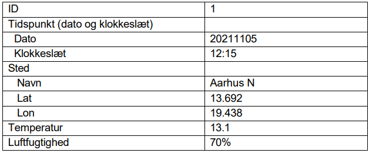
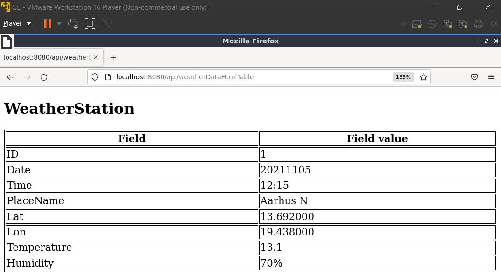

# Part 1 ( Web server )

## Introduction
For this and the following parts we are using a c++ header only library called restinio to implement the web server. The genereal structure of the server program is as follows.

In the main function there is a call to restinio::run(). This is what starts the server. 

```Cpp
restinio::run(
			restinio::on_this_thread< traits_t >()
				.address( "localhost" )
				.request_handler( server_handler(weather_data_collection))
				.read_next_http_message_timelimit(10s)
				.write_http_response_timelimit(1s)
				.handle_request_timeout(1s));
```

Notice that one of the parameters for run(), is a request_handler function. This is the next requirement. Therefore we create such a function, and since we are interrestend in having data, the parameter for the function server_handler takes a struct of type weather_data_collection_t, which is just a vector list of type weather_data_t. Inside the server_handler() there is some boilerplate code at the top but the relevant part is the use of the so called "router". This is how we map specif requests to a functionality, that the server will beform. A code snippet and further explanation will be given later in this journal. 

## What the server must be able to do  

Create a web server, that will act as a weather station which contains information about the weather
For this first part the server must simple return a static html page with some hardcoded weatherdata.

The hardcoded data found in the first version of the webserver should be like this:



The values above are instansiated in the main function before being passed to the serverhandler in
the call to restinio::run(). This way the server will contain data in its weatherDataCollection struct.
This can be shown in the below code snippet:
```Cpp
int main()
{
	using namespace std::chrono;
	
	try
	{
		using traits_t =
			restinio::traits_t<
				restinio::asio_timer_manager_t,
				restinio::single_threaded_ostream_logger_t,
				router_t >;

		weather_data_collection_t weather_data_collection{
			{ "1", "20211105", "12:15", {"Aarhus N", 13.692, 19.438}, "13.1", "70%" },
		}; 	
    ...
```

## The data structures in the server
In order to both store and be able to parse data to and from json, we have to define some structs inside the server program. The reason for using structs is that thats how the restinino library works in conjunction with the json_dto library. The two structs weather_data_t and place_t are shown below:

```Cpp
struct place_t 
{
	place_t() = default;
	
	place_t(std::string placeName, float lat, float lon) 
			: m_placeName{std::move( placeName ) }
			, m_lat{std::move( lat )}
		    , m_lon{std::move( lon )}
	{}

	template<typename JSON_IO>
	void
	json_io(JSON_IO &io)
	{
		io
			& json_dto::mandatory( "PlaceName", m_placeName )
			& json_dto::mandatory( "Lat"	  , m_lat 		)
			& json_dto::mandatory( "Lon"	  , m_lon 		);
	}	

	std::string m_placeName;
	float m_lat;
	float m_lon;
};

struct weather_data_t 
{
	weather_data_t() = default;
	
	weather_data_t(std::string id, std::string date, std::string timeOfEntry, 
					place_t place, std::string temp, std::string rh)
		:	m_id{std::move( id ) } 	
		,   m_date{std::move( date ) }
		,   m_time{std::move( timeOfEntry ) }
		,	m_place{std::move( place ) }
		, 	m_temp{std::move( temp ) }
		,	m_rh{std::move( rh ) }
	{}

	template<typename JSON_IO>
	void
	json_io(JSON_IO &io)
	{
		io
			& json_dto::mandatory( "ID"   		, m_id   )
			& json_dto::mandatory( "Date" 		, m_date )
			& json_dto::mandatory( "Time" 		, m_time )
			& json_dto::mandatory( "Place"		, m_place)
			& json_dto::mandatory( "Temperature", m_temp )
			& json_dto::mandatory( "Humidity"	, m_rh 	 );
	}

	std::string m_id;
	std::string m_date;
	std::string m_time;
	place_t m_place;
	std::string m_temp;
	std::string m_rh;
};
```
Notice how the structs are encapsulating the template function "json_io" which is where the mapping of key value pairs are done. This will not be needed right now, but in later parts, where we instead of static html responses, are creating responses with dto's (data transfer objects).

## Routing of http method and URL
In the forementioned server_handler function we now add a http_get to the router where we specify the URL and method for handling the request. The code snippet below shows how this is done:
```Cpp
auto server_handler(weather_data_collection_t & weather_data_collection) 
{
	auto router = std::make_unique<router_t>();
	auto handler = std::make_shared<weather_data_handler_t>(std::ref(weather_data_collection));

	auto by = [&](auto method) {
		using namespace std::placeholders;
		return std::bind(method, handler, _1, _2);
	};

	auto method_not_allowed = [](const auto & req, auto) {
			return req->create_response(restinio::status_method_not_allowed())
					.connection_close()
					.done();
		};

 ...
	// Handler for returning the hardcoded weatherdata as html table.
	router->http_get( "/api/weatherDataHtmlTable", by(&weather_data_handler_t::on_weatherData_htmlTable));
...
```

## Implementing the method  


```Cpp
auto on_weatherData_htmlTable(const restinio::request_handle_t& req, rr::route_params_t) const
	{
		auto resp = init_resp(req->create_response());

		resp.append_header("Server", "WeatherStation API Interface");
		resp.append_header_date_field();
		resp.append_header(
					restinio::http_field::content_type,
					"text/html; charset=utf-8");	
		resp.set_body("<!DOCTYPE html><html><style>table, th, td {border:1px solid black;}</style><body>");
		resp.append_body("<h2>WeatherStation</h2>");

		// link for table code check https://www.w3schools.com/html/tryit.asp?filename=tryhtml_table3
		for (auto i = m_weather_data.begin(); i != m_weather_data.end(); i++)
		{
			resp.append_body("<table style='width:100%'>");
			resp.append_body("<tr>");
			resp.append_body("<th>Field</th>");
			resp.append_body("<th>Field value</th>");
			resp.append_body("</tr>");
			resp.append_body("<tr>");
			resp.append_body("<td>ID</td>");
			resp.append_body("<td>" + i->m_id + "</td>");
			resp.append_body("</tr>");
			resp.append_body("<tr>");
			resp.append_body("<td>Date</td>");
			resp.append_body("<td>" + i->m_date + "</td>");
			resp.append_body("</tr>");
			resp.append_body("<tr>");
			resp.append_body("<td>Time</td>");
			resp.append_body("<td>" + i->m_time + "</td>");
			resp.append_body("</tr>");
			resp.append_body("<tr>");
			resp.append_body("<td>PlaceName</td>");
			resp.append_body("<td>" + i->m_place.m_placeName + "</td>");
			resp.append_body("</tr>");
			resp.append_body("<tr>");
			resp.append_body("<td>Lat</td>");
			resp.append_body("<td>" + std::to_string(i->m_place.m_lat) + "</td>");
			resp.append_body("</tr>");
			resp.append_body("<tr>");
			resp.append_body("<td>Lon</td>");
			resp.append_body("<td>" + std::to_string(i->m_place.m_lon) + "</td>");
			resp.append_body("</tr>");
			resp.append_body("<tr>");
			resp.append_body("<td>Temperature</td>");
			resp.append_body("<td> " + i->m_temp + "</td>");
			resp.append_body("</tr>");
			resp.append_body("<tr>");
			resp.append_body("<td>Humidity</td>");
			resp.append_body("<td>" + i->m_rh + "</td>");
			resp.append_body("</tr></table>");
			resp.append_body("<br>");
		}
		resp.append_body("</body></html>");
		return resp.done();
	}
```

## Testing the server

In order to test the webserver we will be using the browser mozilla firefow, since we are only needing to send a GET request to the URL "localhost:8080/api/weatherDataHtmlTable". The result of the test is shown below:


This is all for the first part.

# Part 2 ( Creating a Web API )

## What the API must be able to do

### Create new weatherData
Through the use of the API a user must be able to add new data to the server.

### Fetching weatherData from the server
The the use of the API a user must be able to fetch the three latest weatherData entries from the server.
Furthermore be able to fetch weatherData based on the date. 
Lastly the user should be able to fetch all weatherData entries from the server.

### Updating existing weatherData
The user should be able to update existing weatherData, which will then be stored in the server, so
other clients will be able to see the new data. 

## Adding more routing

## Implementing methods for POST, GET and PUT.

## Testing the API

In order to test the webservers API we will again be using the program Postman to simulate the client part,
and this time send both GET, PUT and POST requests matching the end points we added.

# Part 3 ( Upgrading the connection to webSocket protocol )

## What the webSocket connection should be able to do
Clients should be able to connect and receive live updates every time the server receives new data.
The client will be implemented using HTML, JavaScript (using axios library). 

Furthermore, the webSocket connecetion should be able to handle the all CRUD operations 
(Create, Read, Update and Delete) so the client program can have a table for the data and some 
indication to show what operation has been done. 

### Creating the client with a listener
Client will be in a html file. The client creates an instance of socket and tries to connect to the
servers websocket. There will be an event listener attached to the socket instance, that will on 
succefull connection enable the client and server to start communicating. 

## Adding the webSocket functionality to the server

## Testing the webSocket connectivity and functiionality. 


 
